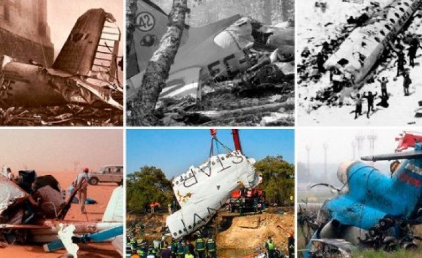

# Proyecto N°3 de Data Analytics para Henry - Accidentes de Aviones

----

 

La **Organización de Aviación Civil Internacional (OACI)**, organismo de la Organización de las Naciones Unidas, quiere investigar en profundidad los accidentes producidos desde inicios del siglo XX. Para ello, nos solicita la elaboración de un informe y un dashboard interactivo que recopile tal información. 

La OACI únicamente cuenta con un dataset sobre datos de accidentes de aviones, pero insta a la consultora de datos -de la que forman parte- que intente cruzar esta información con otras fuentes de su interés. Esto con el objetivo de obtener mayor claridad y consistencia en los fundamentos del estudio.

**Pasos a seguir:**

* Se realizo la lectura del csv en el notebook *EDA+Transfor.ipynb* en donde se detalla la exploracion de los datos y el proceso de ETL.
 
 

----

 

* **Diccionario de Datos.**

Explicacion de columnas del dataset: 
**id** : Identificador unico de cada accidente. 
**Fecha** : Fecha en la que ocurrio el accidente. 
**Ruta** : Lugar del accidente. 
**Operador** : Operador del avion. 
**Trayecto** : Lugar de salida y llegada que debia hacer el avion. 
**Modelo del avion** : Nombre del modelo del avion. 
**Registro** : Registro del avion. 
**Total a bordo** : Total de personas a bordo, incluye pasajeros y tripulantes. 
**Pasajeros a bordo** : Total de solo pasajeros. 
**Tripulantes a bordo** : Total de solo Tripulantes. 
**Total fallecidos** : Total de personas fallecidas, pasajeros y tripulantes. 
**Fatalidad pasajeros** : Cantidad de pasajeros que murieron a bordo. 
**Fatalidad tripulantes** : Cantidad de tripulantes que murieron a bordo. 
**Fatalidad en tierra** : Cantidad de personas que murieron no estando a bordo, sino que en tierra. 
**Año** : Año en que ocurrio el accidente. 
**Tipo de operador** : Si el avion es militar o comercial. 
**Origen** : Lugar donde se creo el avion. 

